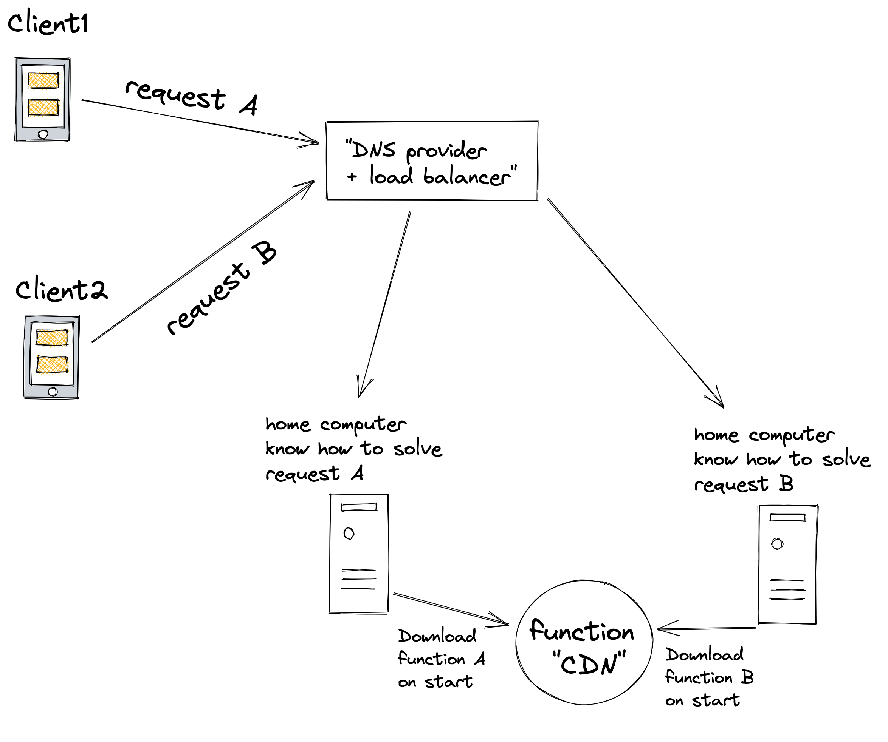

# 10 Years Abstraction

I think the next level of abstraction can follow the same pace as crypto mining does where you get paid for the computational power you provide.

Users of a network will be able to provide processing power from their computers in a kind of p2p + serveless in which they would be rewarded for the time they perform a certain function provided by a "CDN", in which case a software abstraction would be needed to ensure security and reliability of the code that is being used, it will also be necessary to deal with any problems that may happen with a "home computer" server, lack of electricity, internet, machine problems, etc...

  

